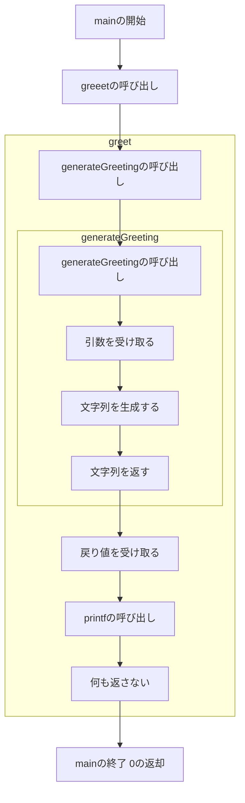

# 関数

プログラミングでは、同じ処理を何度も書くのは面倒です。そこで、同じ処理をまとめて名前をつけておくことができます。これを関数と呼びます。

## 関数の定義

C++では、関数を定義するには`関数の戻り値の型 関数名(引数)`という形式で書きます。

```cpp
戻り値の型 関数名(引数)
{
    // 関数の処理
}
```

実際に、挨拶を行うプログラムを書いてみましょう。

```cpp
#include <cstdio>

void greet()
{
    printf("Hello\n");
}

int main()
{
    greet();
}
```

最初のmain関数の中で、greet関数を呼び出しています。

<br>

## 関数の戻り値

関数は、戻り値を返すことができます。戻り値を返すには、関数の戻り値の型を指定します。

```cpp
戻り値の型 関数名(引数)
{
    // 関数の処理
    return 戻り値;
}
```

実際に、挨拶を行うプログラムを書いてみましょう。

```cpp
#include <cstdio>

const char* generateGreeting(int age, char* name)
{
    char* greeting = new char[100];
    sprintf(greeting, "Hello, %s. You are %d years old.\n", name, age);
    return greeting;
}

void greet()
{
    printf("%s", generateGreeting(20, "Taro"));
}

int main()
{
    greet();
}
```

新しく、`generateGreeting`関数を定義しました。この関数は、`age`と`name`を受け取り、`Hello, Taro. You are 20 years old.`という文字列を返します。

<br>



<br>

## 可変長引数

関数の引数は、可変長にすることができます。可変長引数を使うには、`...`を引数の型の後ろにつけます。

処理する際は、関数自体は引数の数を数えられないので、引数の数を数えるための変数をなどを用意する必要があります。

```cpp
戻り値の型 関数名(引数, ...)
{
    // 関数の処理
}
```

実際に、可変長な引数を受け取って、合計を返す関数を書いてみましょう。

```cpp
#include <cstdio>
#include <cstdarg>

int sum_int(int count, ...)
{
    va_list ap;
    va_start(ap, count);
    int sum = 0;
    for (int i = 0; i < count; ++i)
        sum += va_arg(ap, int);
    va_end(ap);
    return sum;
}

int main()
{
    printf("sum: %d\n", sum_int(3, 1, 2, 3));
}
```

第一引数には、引数の数を指定します。第二引数以降には、引数を指定します。

<br>

引数に色々な型を混ぜる場合は、それを明示する手段が必要になります。（例：printfの%d,%fなど）

<br>
