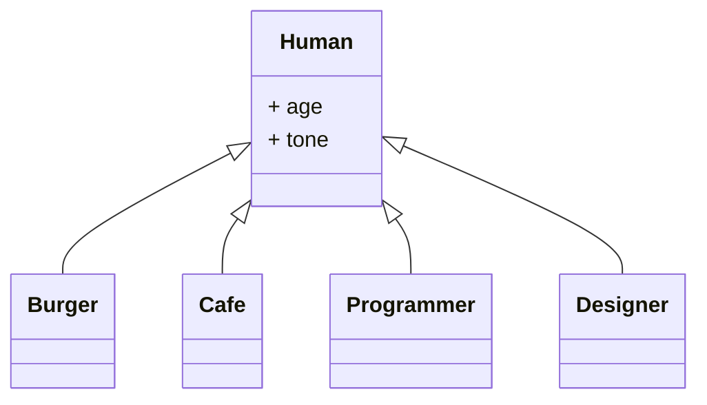
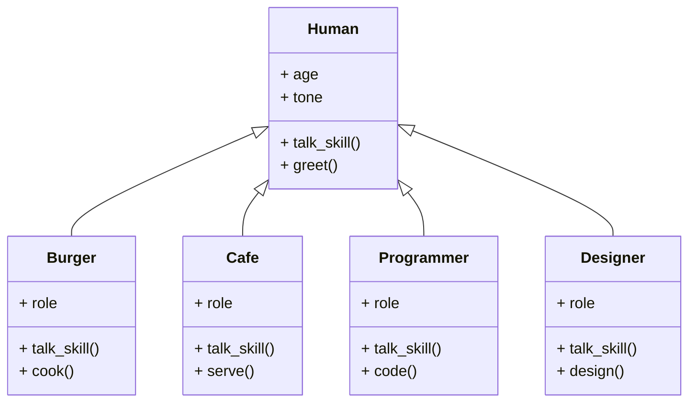
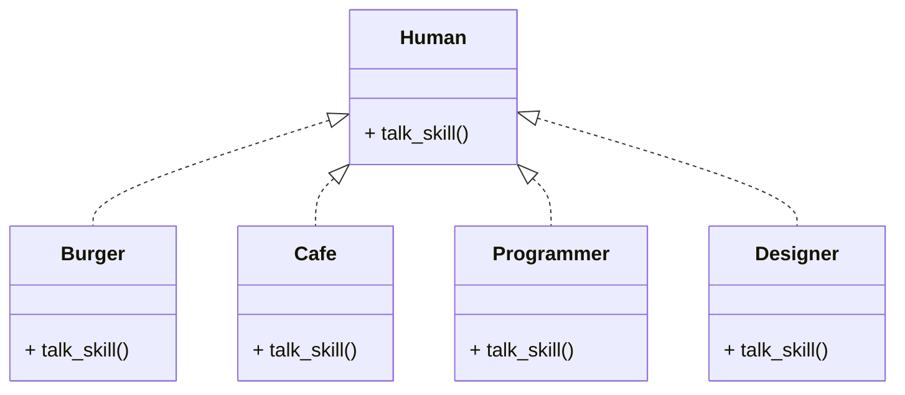
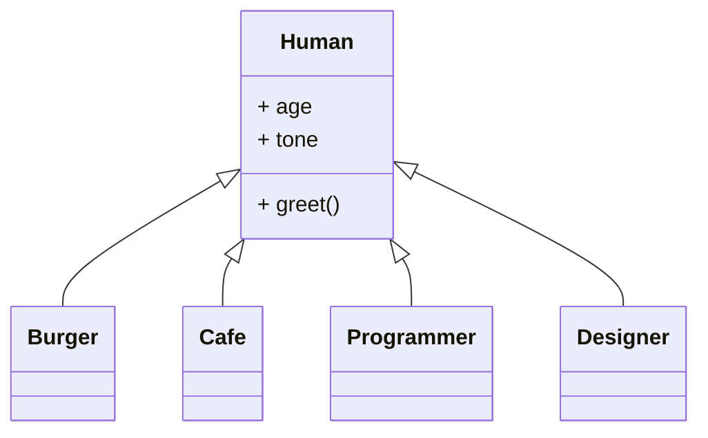

# 継承

継承はオブジェクト指向プログラミングの基本となる概念です。

## 継承とは

継承とは、あるクラスの機能を別のクラスに引き継ぐことです。

例えば、人間と職業の関係をクラスにしようと思います。

<!-- 画像 -->

<br>

例えば、次の職業について考えてみましょう。

- ハンバーガ店の店員
- カフェの店員
- プログラマ
- デザイナー

これらの職業に就くためにはそもそも人間である必要が多いですから、人間は全ての職業に共通するクラスとなります。

<!-- 画像 -->



<br>

ただし、それぞれの仕事において機能の役割が異なります。

例えば、どの職業もコミュニケーションは必要ですが、話す内容・スキルは異なると思います。

また、職業特有の機能が必要な場合もあります。例えば、Burgerであれば、料理スキルが必要でしょう。

<!-- 画像 -->



共通のスキル「talk_skill」は職業ごとに再度定義すべきでしょう。

これは「実現（realize）」と呼ばれます。



<br>

また、共通のスキル「greet」と性質「age」と「tone」は職業によらず共通であるため、一度定義すれば良いでしょう。

これは「汎化（generalization）」と呼ばれます。




<br>

これらをC++で表現すると次のようになります。

```cpp
#define ROLE_OWNER 1
#define ROLE_EMPLOYEE 2

#define TONE_HIGH 1
#define TONE_MIDDLE 2
#define TONE_LOW 3

class Human {
public:
    int age;
    int tone;
    virtual void talk_skill()=0;
    void greet() {
        // 何かしらの処理
    }
};

class Burger : public Human {
public:
    Burger(int age, int tone, int role) {
        this->age = age;
        this->tone = tone;
        this->role = role;
    }
    void talk_skill() {
        greet();
        // 何かしらの処理
    }

    void cook() {
        // 何かしらの処理
    }

    int role = ROLE_EMPLOYEE;
};

class Cafe : public Human {
public:
    Cafe(int age, int tone, int role) {
        this->age = age;
        this->tone = tone;
        this->role = role;
    }
    void talk_skill() {
        greet();
        // 何かしらの処理
    }

    void serve() {
        // 何かしらの処理
    }

    int role = ROLE_EMPLOYEE;
};

class Programmer : public Human {
public:
    Programmer(int age, int tone, int role) {
        this->age = age;
        this->tone = tone;
        this->role = role;
    }
    void talk_skill() {
        greet();
        // 何かしらの処理
    }

    void code() {
        // 何かしらの処理
    }

    int role = ROLE_EMPLOYEE;
};

class Designer : public Human {
public:
    Designer(int age, int tone, int role) {
        this->age = age;
        this->tone = tone;
        this->role = role;
    }
    void talk_skill() {
        greet();
        // 何かしらの処理
    }

    void design() {
        // 何かしらの処理
    }

    int role = ROLE_EMPLOYEE;
};

int main() {
    Burger burger(20, TONE_HIGH, ROLE_OWNER);
    burger.talk_skill();

    Cafe cafe(20, TONE_MIDDLE, ROLE_EMPLOYEE);
    cafe.talk_skill();

    Programmer programmer(20, TONE_LOW, ROLE_EMPLOYEE);
    programmer.talk_skill();

    Designer designer(20, TONE_LOW, ROLE_EMPLOYEE);
    designer.talk_skill();
}
```

「人間」クラスの機能「talk_skill()」を「Burger」クラスなどで具体化していると言えます。これは「実現（realize）」です。

<br>

## 継承の種類

継承にはいくつかの種類があります。

- 単一継承
- 複数継承
- 多重継承

### 単一継承

単一継承とは、あるクラスが一つのクラスのみを継承することです。

例えば、次のようになります。

```cpp
class A {};
class B : public A {};
```

<br>

### 複数継承

複数継承とは、あるクラスが複数のクラスを継承することです。

例えば、次のようになります。

```cpp
class A {};
class B {};
class C : public A, public B {};
```

class Cはclass Aとclass Bの機能を継承しています。

<br>

### 多重継承

多重継承とは、あるクラスが複数のクラスを継承し、さらにそのクラスを継承することです。

例えば、次のようになります。

```cpp
class A {};
class B : public A {};
class C : public B {};
```

class Cはclass Aを継承したclass Bを継承しています。

<br>

## 継承のメリット

継承を使うことで、次のようなメリットがあります。

- コードの再利用: 継承を使用することで、既存のクラスのコードを基にして新しいクラスを定義できます。これにより、新しいクラスは既存のクラスで定義された機能を継承することができるため、新しいクラスを作成するために必要なコードを書く必要がなくなります。

- コードの変更を抑える: 継承を使用することで、複数のクラスで共通の機能を実装する場合、基底クラスでその機能を定義するだけで、派生クラスでもその機能を利用できるようになります。これにより、複数のクラスで同じ機能を実装している場合、基底クラスを変更するだけで、複数のクラスで共通の機能を一括して変更することができます。

- クラスの抽象化: 継承を使用することで、クラスを抽象化することができます。基底クラスで共通の機能を定義し、派生クラスで特定の機能を定義することで、クラスの責務を明確にすることができます。これにより、クラスをよりわかりやすく設計することができます。

<br>

## デメリット

主に、継承には次のようなデメリットがあります。

ほとんどの場合、設計者の能力によります。そのため、継承を使用するメリットが開発の妨げになるデメリットを上回らない場合は使用しない方がいいかもしれません。

- 複雑さの増加: 継承を使用することで、クラス階層が複雑になることがあります。これにより、クラス間の関係がわかりにくくなることがあります。

- 変更に強い依存関係: 継承を使用することで、クラス間に強い依存関係が生じることがあります。これにより、基底クラスを変更すると、派生クラスにも影響が出ることがあります。

継承を使用しすぎると、クラス設計が複雑になり、変更が難しくなることがあります。また、継承を使用しすぎると、クラスの責務が曖昧になることがあります。これにより、クラスをわかりにくくし、プログラムを理解することが困難になることがあります。

そのため、継承を使用する場合は、適切に使用することが重要です。また、継承を使用する場合は、クラス設計をよく考え、複雑になりすぎないようにすることが重要です。

<br>

