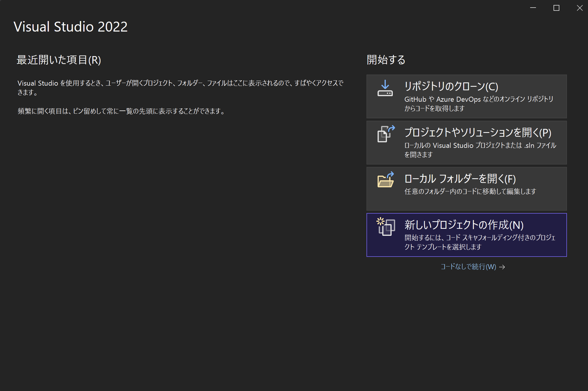
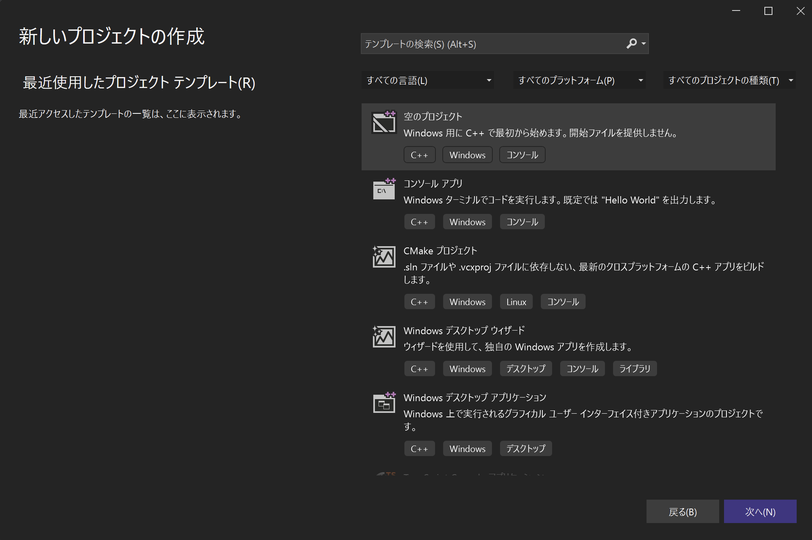
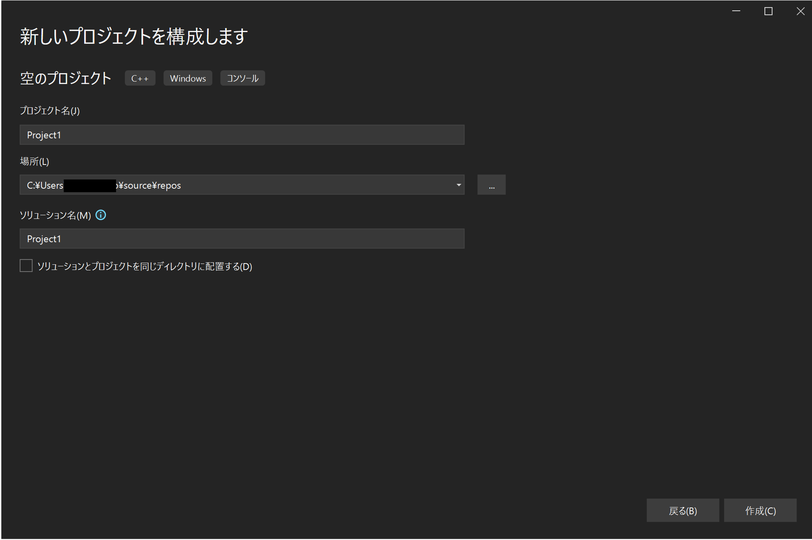
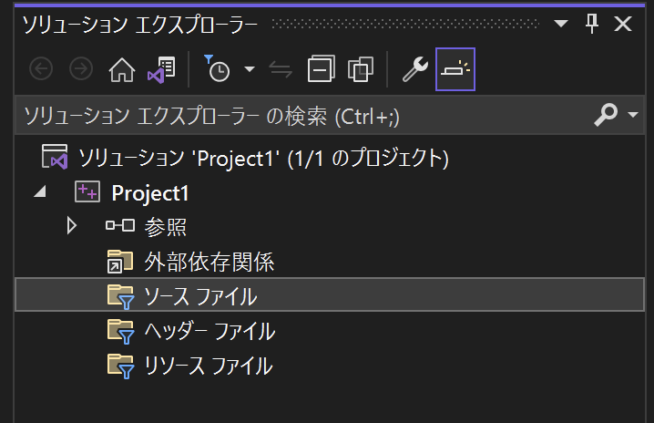
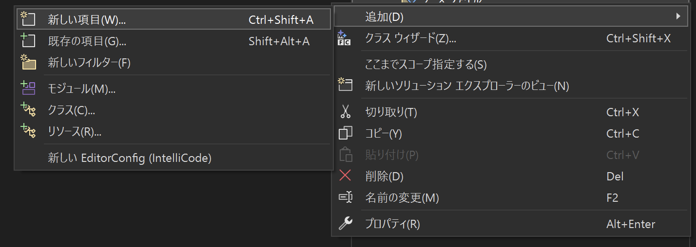
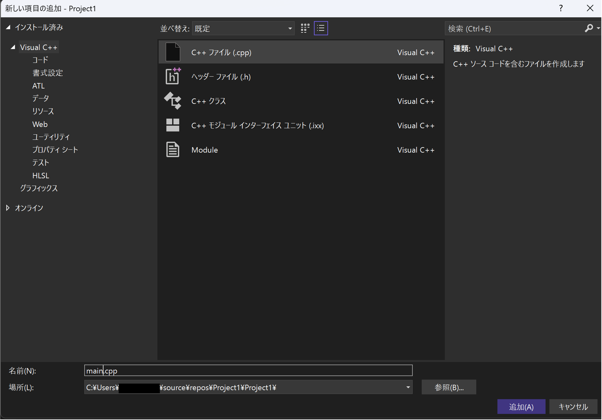
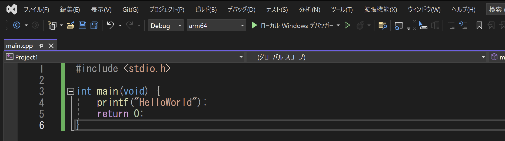
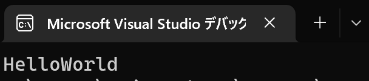

# Getting start
Visual Studioで新規プロジェクトを作成してC言語で記載されたプログラムを実行します。

## Create a New Project

1. `新しいプロジェクトの作成`を選択します。

    

2. `空のプロジェクト`を選択し`次へ`をクリックします。

    

3.  プロジェクト名などはデフォルトのままで問題ありません。

    

## Build

1. `ソリューションエクスプローラ`にある`ソースファイル`フォルダを右クリックします。

    

2. 追加 -> 新しい項目の順に選択します。

    

3. C++ファイルを選択し追加します。この時にファイル名を`main.cpp`に変更します。

    

4. `main.cpp`に以下のプログラムを記入します。

    ```C
    #include <stdio.h>

    int main(void) {
        printf("HelloWorld");
        return 0;
    }
    ```

5. `ローカルWindowsデバッガー`をクリックして実行します。`arm64`と記載されている部分は環境によって異なります。

    

6. 黒い画面が起動し`HelloWorld`と表示されれば成功です。

    