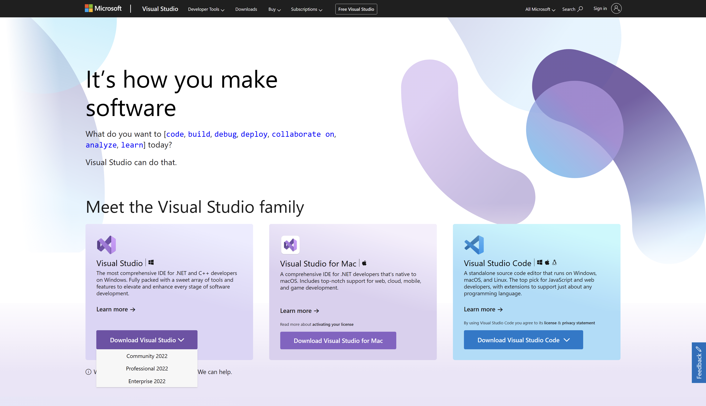
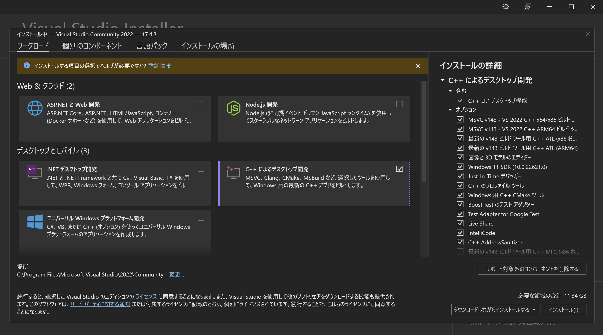
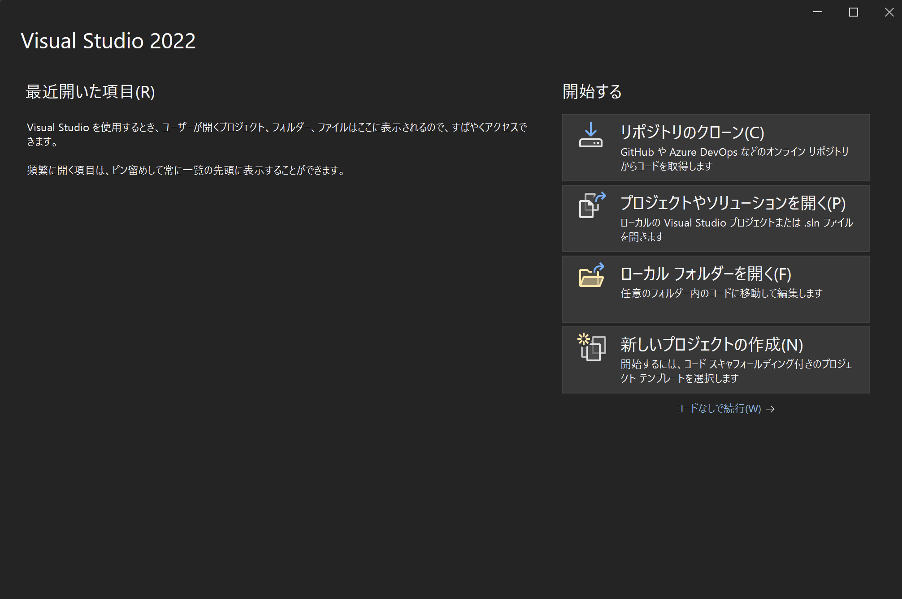

# How to install Visual Studio?

## Download
[https://visualstudio.microsoft.com/](https://visualstudio.microsoft.com/)にアクセスして`VisualStudio Commnity 2022`をダウンロードする。

## Install
インストーラーを実行するとインストールするコンポーネントを聞かれるので`C++によるデスクトップ開発`を選択する。

## Complete install
以下の画面が表示されれば成功です。

