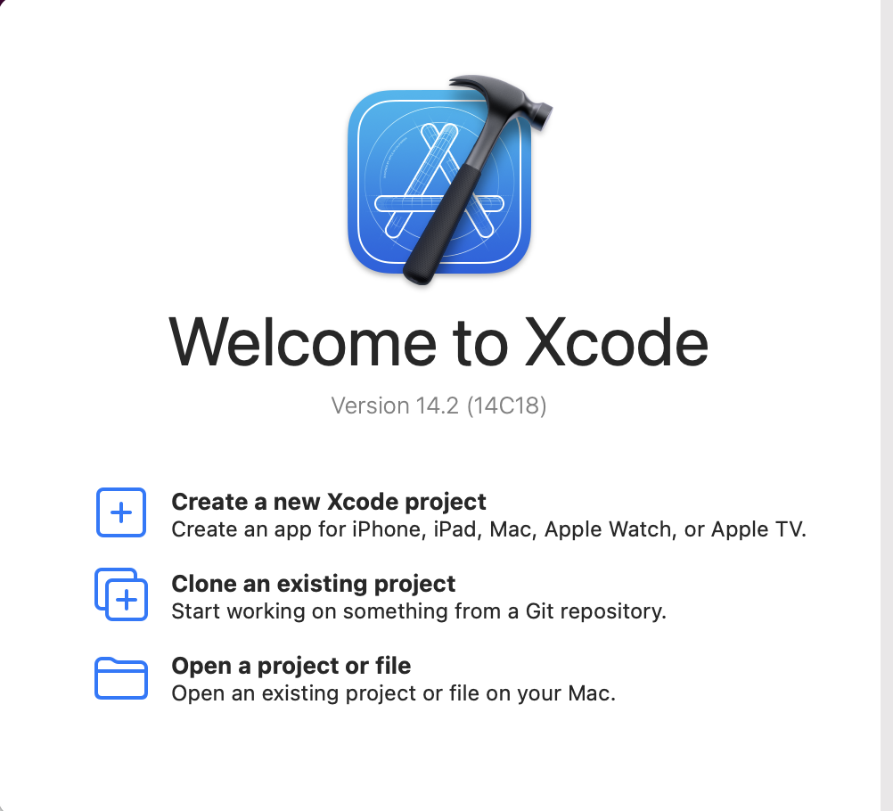
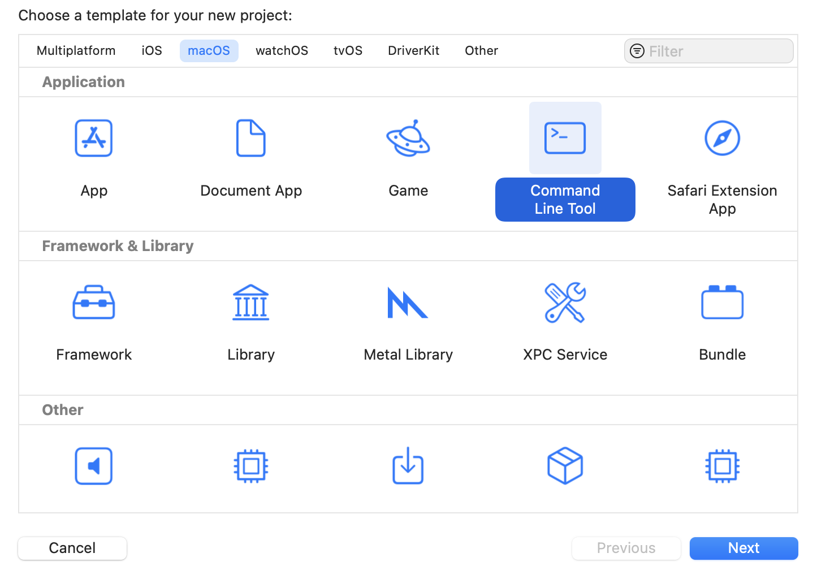
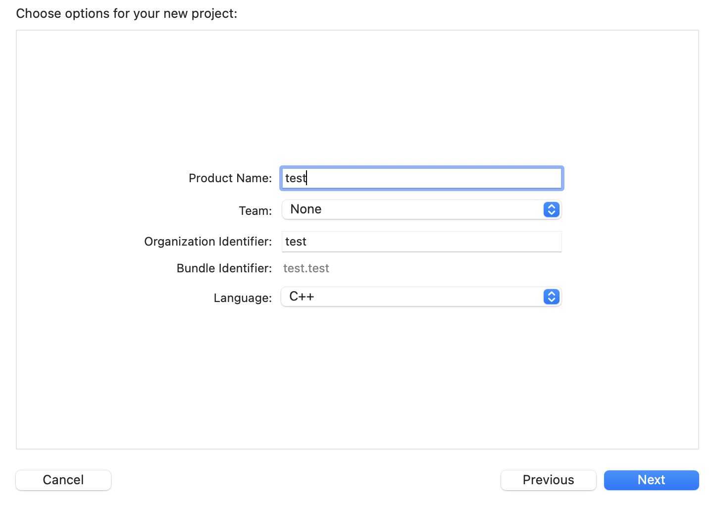
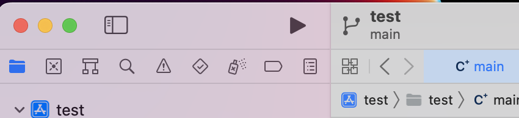
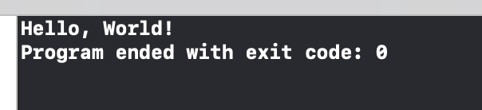

# Getting Start

## Installtion
[App store/xcode](https://apps.apple.com/jp/app/xcode/id497799835?l=en&mt=12)をインストールします。インストールには時間がかかる(1h ~ 2h)ので再起動などはせずに放置します。

## Create project

1. `Create a new Xcode project`を選択します。

    

2. `MacOS`タブにある`command line tool`を選択します。

    

3. 画像の通りに記入します。

    

4. 三角ボタンを押して実行します。

    

5. `HelloWorld`と出力されていることを確認します。

    